Gmail-BIU
=========

Jira link:
https://live-team-nlx6demi.atlassian.net/jira/software/projects/SCRUM/boards/1

---

Overview
--------
Gmail-BIU is a lightweight Gmail-like mail system, featuring:
- **Backend**: Secure mail handling, user management, URL filtering with a Bloom filter to detect malicious links.
- **Frontend**: React-based web UI with full mail management capabilities, including light/dark mode, labels, spam filtering, and user session control.
- **Mobile UI**: A dedicated Android interface offers a mobile-first experience that mirrors the functionality of the web UI, optimized for smaller screens and touch interactions.
- Communication is via JSON REST-like API over HTTP.

---

Features
------------

### Frontend (React Web UI)
1. Responsive web interface built with React.
2. Login page.
3. Register page.
4. Light and Dark mode toggle for user preference.
5. Send emails by specifying recipient username.
6. Associate mails with labels for organization.
7. Move emails to Trash for soft deletion.
8. Mark mails as Spam; URLs inside become spam URLs.
9. Remove mails from Spam, restoring URL validity.
10. Search mails by words in title or body content.
11. Star important mails for quick access.
12. Add or remove labels dynamically.
13. Create new mails from scratch.
14. User logout functionality to exit the session safely.

### Mobile UI (Android)
A newly added Android UI now complements the web application, delivering a native experience tailored for mobile users:
- Built with Android-native components for responsiveness and accessibility.
- Supports all core functionalities of the web UI: login, registration, viewing and sending emails, labeling, spam handling, and more.
- Connects to the same backend API, ensuring feature parity with the web client.
- Enables on-the-go access to Gmail-BIU with a touch-optimized interface.

### Backend API
#### User Management
- Create, authenticate, fetch user data.
#### Mail Handling
- Send, retrieve, update, delete mails.
- Retrieve last 50 mails.
- Search mails by keywords.
#### Labels
- Create, update, delete custom labels.
#### URL Blacklisting (Bloom Filter Engine)
- Manage blacklist with add, check, and remove URLs.
- Reject mails containing blacklisted URLs.

### How It Works
- Server runs on configured port.
- Bloom filter parameters (bit array size, number of hashes) passed as arguments.
- JSON REST API for all operations.
- No frontend in backend repo; React client and Android client communicate via API.
---

Requirements
------------
- Docker
- Linux OS

---

Usage
-------------
**Build**
```
docker-compose build --no-cache
```
**Clean up**
```
docker-compose down --remove-orphans
```
**Run tests**
```
docker-compose run tests
```
**Start services**
```
docker-compose run --service-ports web_client   # Execute the entire server (both backend and frontend)
docker-compose run --service-ports web_app      # Execute the web app and the bloom-filter server
docker-compose run --service-ports server_app   # Execute the bloom filter-server
docker-compose run --service-ports client_app   # Execute the python bloom-filter client
```
**Run Android UI**
- The Android app communicates with the backend API served by the running `web_app` service.
- To use the Android UI, ensure the `web_app` service is running, then build and run the Android application from its source code using Android Studio or your preferred Android build tools.
- The Android app functions as a native client, mirroring the web UI features and relying on the backend APIs exposed by `web_app`.

---

### React Web UI Preview

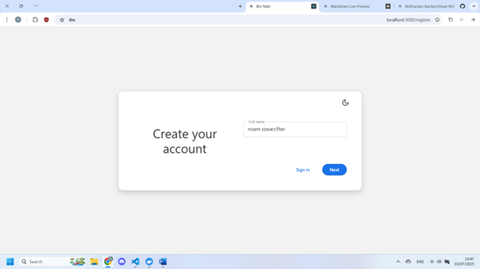

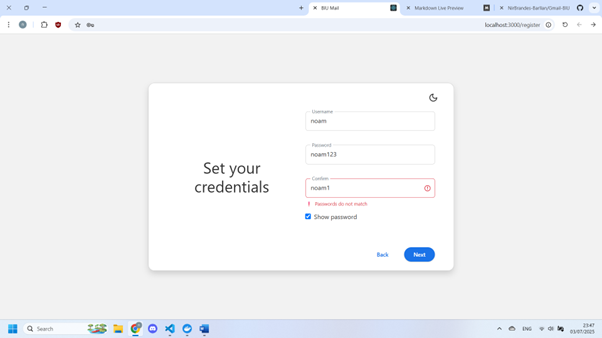

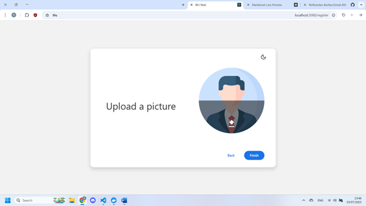

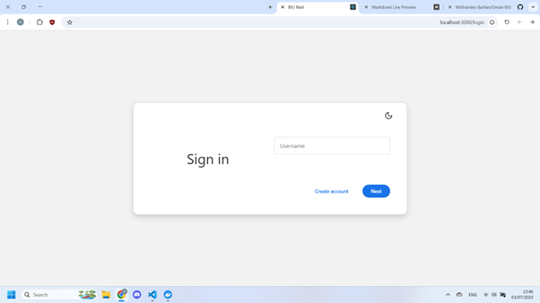

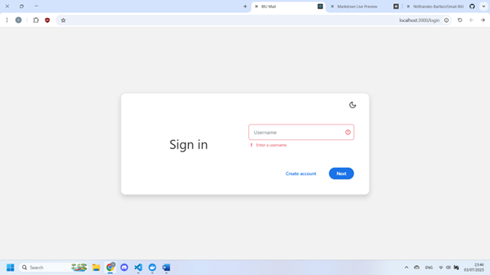

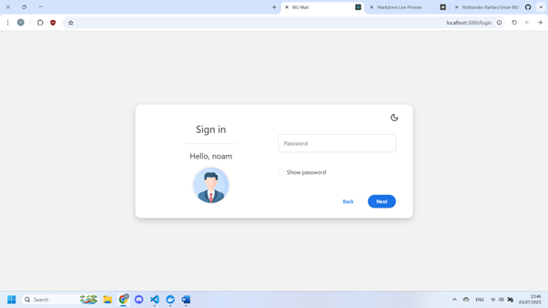

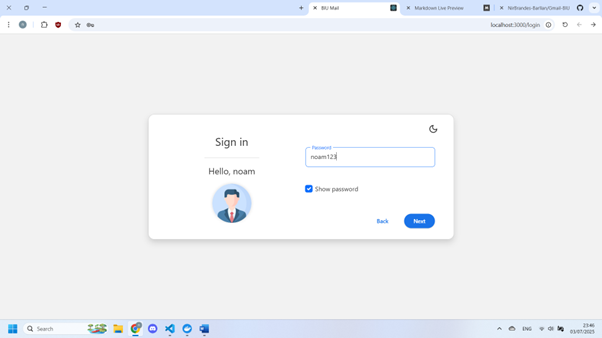

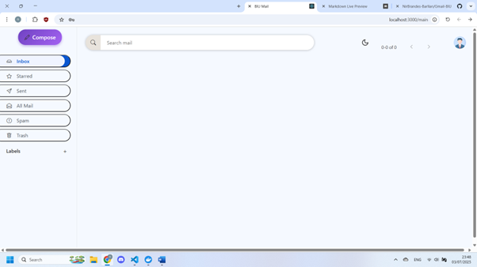

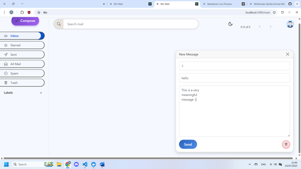

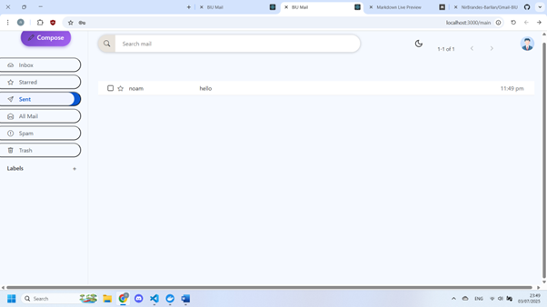

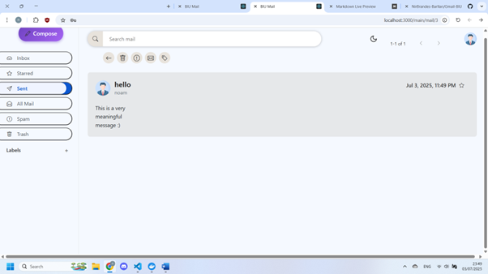

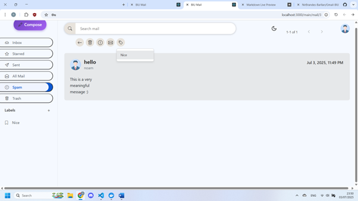

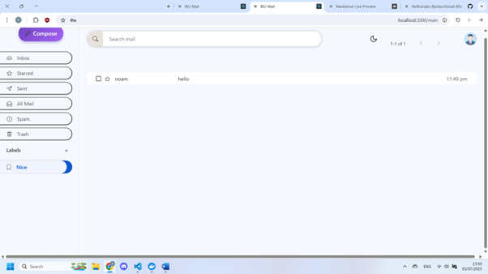

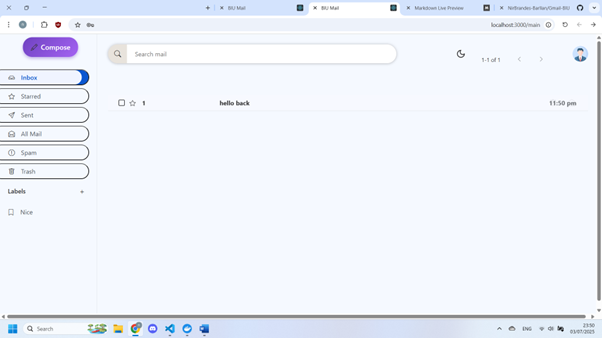

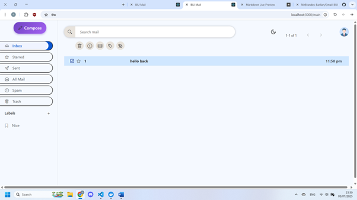

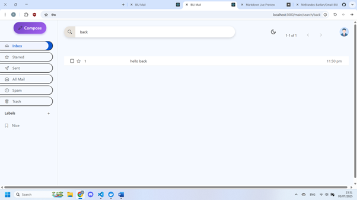

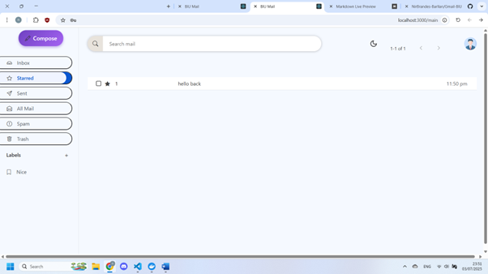

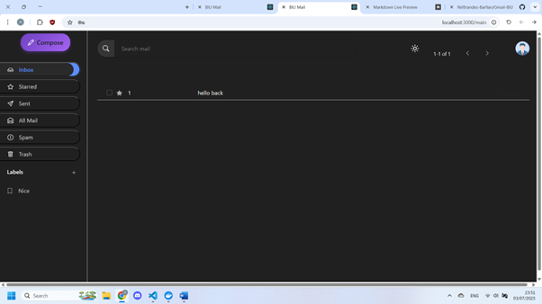

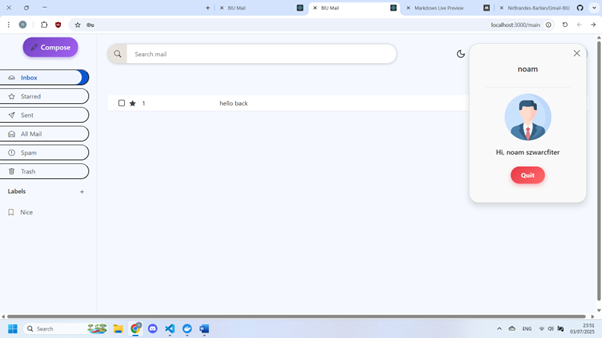

### Android UI Preview

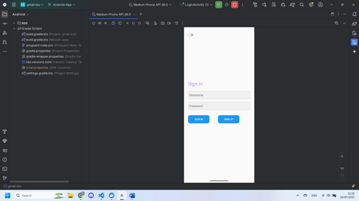


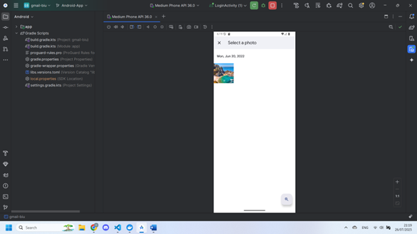

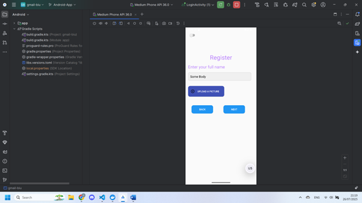

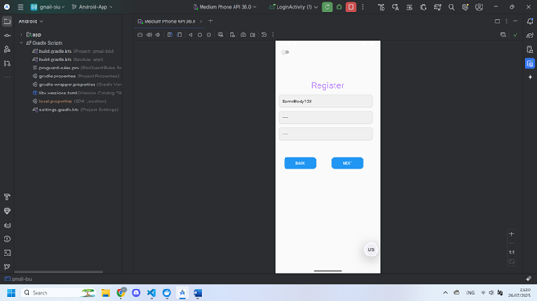

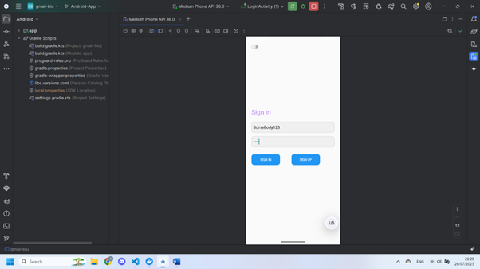

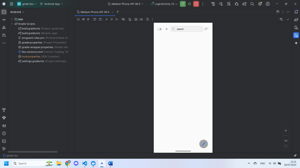


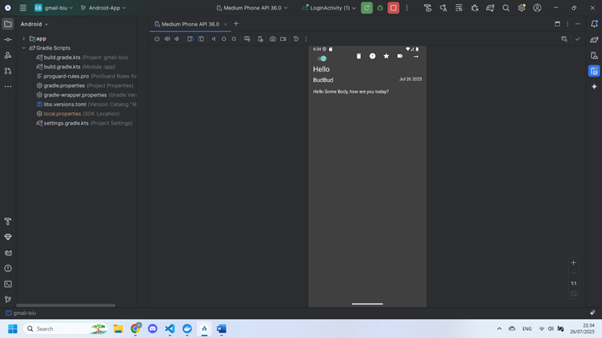

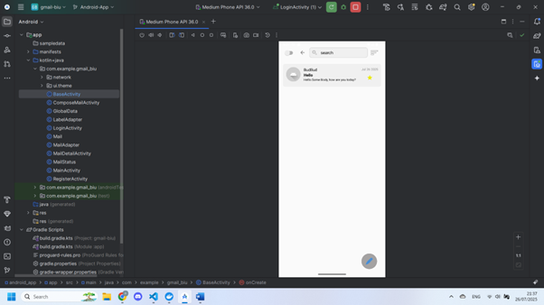

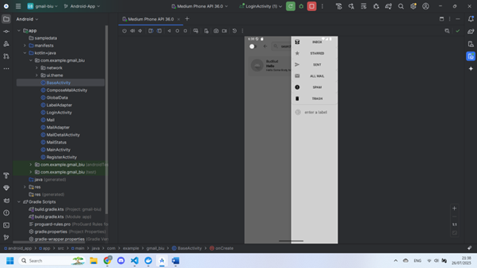


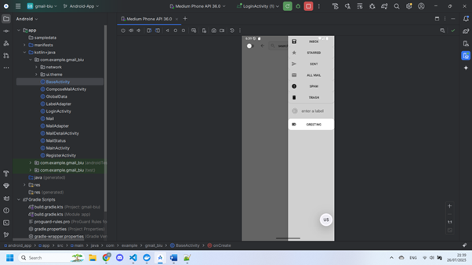

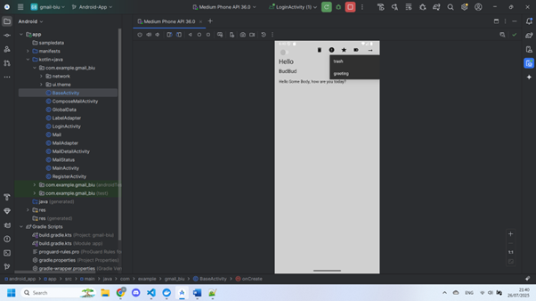

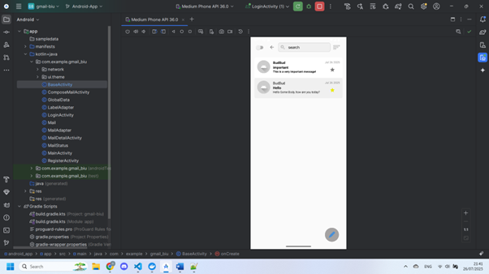


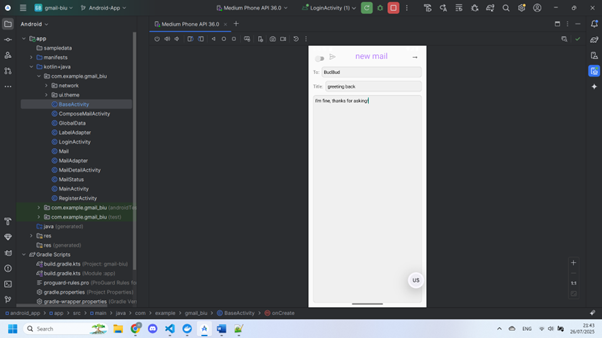


API Examples
--------
### Web Server:
```
curl -i -X POST http://localhost:3000/api/users \
-H "Content-Type: application/json" \
-d '{"username": "user1", "password": "123456"}'

HTTP/1.1 201 Created
X-Powered-By: Express
Content-Type: application/json; charset=utf-8
Date: Wed, 04 Jun 2025 17:44:16 GMT
Connection: keep-alive
Keep-Alive: timeout=5
Content-Length: 0
```
```
curl -i -X POST http://localhost:3000/api/tokens \
-H "Content-Type: application/json" \
-d '{"username": "user1", "password": "123456"}'

HTTP/1.1 201 Created
X-Powered-By: Express
Content-Type: application/json; charset=utf-8
Content-Length: 10
ETag: W/"a-ReGdUv1iAJHRTrEYwlTFmKZb2ik"
Date: Wed, 04 Jun 2025 17:45:47 GMT
Connection: keep-alive
Keep-Alive: timeout=5

{"id":"0"}
```
```
curl -i http://localhost:3000/api/users/0

HTTP/1.1 200 OK
X-Powered-By: Express
Content-Type: application/json; charset=utf-8
Content-Length: 27
ETag: W/"1b-rLabxlwR7ksHBDRqUNgd3f8FQUQ"
Date: Wed, 04 Jun 2025 17:44:49 GMT
Connection: keep-alive
Keep-Alive: timeout=5

{"id":0,"username":"user1"}
```
```
curl -i -X POST http://localhost:3000/api/mails \
-H "Content-Type: application/json" \
-H "X-User-ID: 0" \
-d '{"addressee": "user2", "title": "Hello", "content": "Hi there!"}'

HTTP/1.1 201 Created
X-Powered-By: Express
Content-Type: application/json; charset=utf-8
Date: Wed, 04 Jun 2025 17:49:51 GMT
Connection: keep-alive
Keep-Alive: timeout=5
Content-Length: 0
```
```
curl -i http://localhost:3000/api/mails \
-H "X-User-ID: 0"

HTTP/1.1 200 OK
X-Powered-By: Express
Content-Type: application/json; charset=utf-8
Content-Length: 99
ETag: W/"63-1y2EZeA9YahfPUPVNvEetbo4c48"
Date: Wed, 04 Jun 2025 17:51:15 GMT
Connection: keep-alive
Keep-Alive: timeout=5

[{"id":0,"sender":"user1","receiver":"user2","date":"4.6.2025","title":"Hello","body":"Hi there!"}]
```
```
curl -i http://localhost:3000/api/mails/0

HTTP/1.1 200 OK
X-Powered-By: Express
Content-Type: application/json; charset=utf-8
Content-Length: 97
ETag: W/"61-AsnTLf+Kp5e4shdpIMyKJvC4y+M"
Date: Wed, 04 Jun 2025 17:52:02 GMT
Connection: keep-alive
Keep-Alive: timeout=5

{"id":0,"sender":"user1","receiver":"user2","date":"4.6.2025","title":"Hello","body":"Hi there!"}
```
```
curl -i -X PATCH http://localhost:3000/api/mails/0 \
-H "Content-Type: application/json" \
-d '{"title": "Hello", "content": "New content"}'

HTTP/1.1 204 No Content
X-Powered-By: Express
Date: Wed, 04 Jun 2025 17:53:22 GMT
Connection: keep-alive
Keep-Alive: timeout=5
```
```
curl -i http://localhost:3000/api/mails/0

HTTP/1.1 200 OK
X-Powered-By: Express
Content-Type: application/json; charset=utf-8
Content-Length: 99
ETag: W/"63-KR2bFcuaScozeefr1IymRUl5Zlk"
Date: Wed, 04 Jun 2025 17:53:47 GMT
Connection: keep-alive
Keep-Alive: timeout=5

{"id":0,"sender":"user1","receiver":"user2","date":"4.6.2025","title":"Hello","body":"New content"}
```
```
curl -i -X DELETE http://localhost:3000/api/mails/0

HTTP/1.1 204 No Content
X-Powered-By: Express
Date: Wed, 04 Jun 2025 17:54:23 GMT
Connection: keep-alive
Keep-Alive: timeout=5
```
```
curl -i http://localhost:3000/api/mails/0

HTTP/1.1 404 Not Found
X-Powered-By: Express
Content-Type: application/json; charset=utf-8
Content-Length: 24
ETag: W/"18-bN1amAgelCCiPf4jMWEP/aSnTeI"
Date: Wed, 04 Jun 2025 17:55:06 GMT
Connection: keep-alive
Keep-Alive: timeout=5

{"error":"id not found"}
```
```
curl -i -X POST http://localhost:3000/api/mails \
-H "Content-Type: application/json" \
-H "X-User-ID: 0" \
-d '{"addressee": "user2", "title": "Hello", "content": "Hi there!"}'

HTTP/1.1 201 Created
X-Powered-By: Express
Content-Type: application/json; charset=utf-8
Date: Wed, 04 Jun 2025 17:56:56 GMT
Connection: keep-alive
Keep-Alive: timeout=5
Content-Length: 0
```
```
curl -i http://localhost:3000/api/mails/search/the \
-H "X-User-ID: 0"

HTTP/1.1 200 OK
X-Powered-By: Express
Content-Type: application/json; charset=utf-8
Content-Length: 99
ETag: W/"63-Ferh2igWvSdX7qmfvlK4j/f40CU"
Date: Wed, 04 Jun 2025 17:58:05 GMT
Connection: keep-alive
Keep-Alive: timeout=5

[{"id":1,"sender":"user1","receiver":"user2","date":"4.6.2025","title":"Hello","body":"Hi there!"}]
```
```
curl -i -X POST http://localhost:3000/api/labels \
-H "Content-Type: application/json" \
-d '{"name": "Work"}'

HTTP/1.1 201 Created
X-Powered-By: Express
Location: /api/labels/0
Content-Type: application/json; charset=utf-8
Date: Wed, 04 Jun 2025 17:58:39 GMT
Connection: keep-alive
Keep-Alive: timeout=5
Content-Length: 0
```
```
curl -i http://localhost:3000/api/labels

HTTP/1.1 200 OK
X-Powered-By: Express
Content-Type: application/json; charset=utf-8
Content-Length: 24
ETag: W/"18-zv86FbjiKiiaAgKyzSdCYL+LaOc"
Date: Wed, 04 Jun 2025 17:58:58 GMT
Connection: keep-alive
Keep-Alive: timeout=5

[{"id":0,"name":"Work"}]
```
```
curl -i http://localhost:3000/api/labels/0

HTTP/1.1 200 OK
X-Powered-By: Express
Content-Type: application/json; charset=utf-8
Content-Length: 22
ETag: W/"16-H0zJKYSewdEZ8FhDmHvnws07lko"
Date: Wed, 04 Jun 2025 17:59:26 GMT
Connection: keep-alive
Keep-Alive: timeout=5

{"id":0,"name":"Work"}
```
```
curl -i -X PATCH http://localhost:3000/api/labels/0 \
-H "Content-Type: application/json" \
-d '{"name": "Updated Name"}'

HTTP/1.1 204 No Content
X-Powered-By: Express
Date: Wed, 04 Jun 2025 18:00:10 GMT
Connection: keep-alive
Keep-Alive: timeout=5
```
```
curl -i http://localhost:3000/api/labels

HTTP/1.1 200 OK
X-Powered-By: Express
Content-Type: application/json; charset=utf-8
Content-Length: 32
ETag: W/"20-EEZxykxp1qVxJ8xWFuSGki4Wzj8"
Date: Wed, 04 Jun 2025 18:00:30 GMT
Connection: keep-alive
Keep-Alive: timeout=5

[{"id":0,"name":"Updated Name"}]
```
```
curl -i -X DELETE http://localhost:3000/api/labels/0

HTTP/1.1 204 No Content
X-Powered-By: Express
Date: Wed, 04 Jun 2025 18:01:05 GMT
Connection: keep-alive
Keep-Alive: timeout=5
```
```
curl -i http://localhost:3000/api/labels

HTTP/1.1 200 OK
X-Powered-By: Express
Content-Type: application/json; charset=utf-8
Content-Length: 2
ETag: W/"2-l9Fw4VUO7kr8CvBlt4zaMCqXZ0w"
Date: Wed, 04 Jun 2025 18:01:21 GMT
Connection: keep-alive
Keep-Alive: timeout=5

[]
```
```
curl -i -X POST http://localhost:3000/api/blacklist \
-H "Content-Type: application/json" \
-d '{"url": "www.example.com"}'

HTTP/1.1 201 Created
X-Powered-By: Express
Location: /api/blacklist/www.example.com
Content-Type: application/json; charset=utf-8
Date: Wed, 04 Jun 2025 18:02:04 GMT
Connection: keep-alive
Keep-Alive: timeout=5
Content-Length: 0
```
```
curl -i -X POST http://localhost:3000/api/mails \
-H "Content-Type: application/json" \
-H "X-User-ID: 0" \
-d '{"addressee": "user2", "title": "Hello", "content": "Hello www.example.com world"}'

HTTP/1.1 400 Bad Request
X-Powered-By: Express
Content-Type: application/json; charset=utf-8
Content-Length: 29
ETag: W/"1d-x0qGscHTKGLMO5EqDNZspDFhojw"
Date: Wed, 04 Jun 2025 18:02:35 GMT
Connection: keep-alive
Keep-Alive: timeout=5

{"error":"invalid mail data"}
```
```
curl -i -X DELETE http://localhost:3000/api/blacklist/www.example.com

HTTP/1.1 204 No Content
X-Powered-By: Express
Date: Wed, 04 Jun 2025 18:03:16 GMT
Connection: keep-alive
Keep-Alive: timeout=5
```
```
curl -i -X POST http://localhost:3000/api/mails \
-H "Content-Type: application/json" \
-H "X-User-ID: 0" \
-d '{"addressee": "user2", "title": "Hello", "content": "Hello www.example.com world"}'

HTTP/1.1 201 Created
X-Powered-By: Express
Content-Type: application/json; charset=utf-8
Date: Wed, 04 Jun 2025 18:03:31 GMT
Connection: keep-alive
Keep-Alive: timeout=5
Content-Length: 0
```

### Bloom Filter:

**Example 1:**
```
GET www.example.com0
false
POST www.example.com0
GET www.example.com0
true true
POST www.example.com1
false
GET www.example.com11
true false
DELETE www.example.com1
GET www.example.com1
true false
```
**Example 2:**
```
POST www.example.com0
GET www.example.com0
true true
DELETE www.example.com0
true false
GET www.example.com1
true false
```
**Example 3:**
```
POST www.example.com0
GET www.example.com0
true true
POST www.example.com4
true false
```
